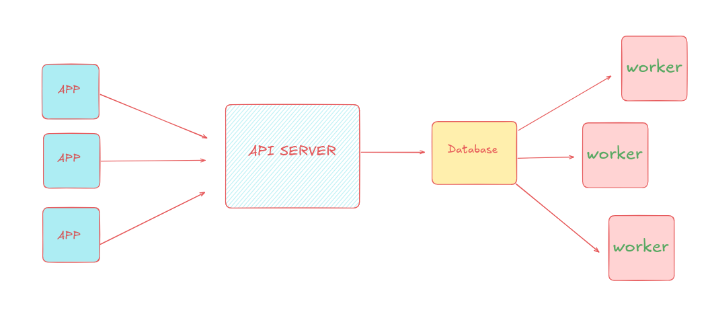

# Drago

A dead simple distributed job processor written in go.

# Architecture

The app submits jobs metadata to the datatore through the drago's api. workers pull those jobs and execute them. The datastore acts as the source of truth persisting job state.

# contributing

contributions are welcome !! 
